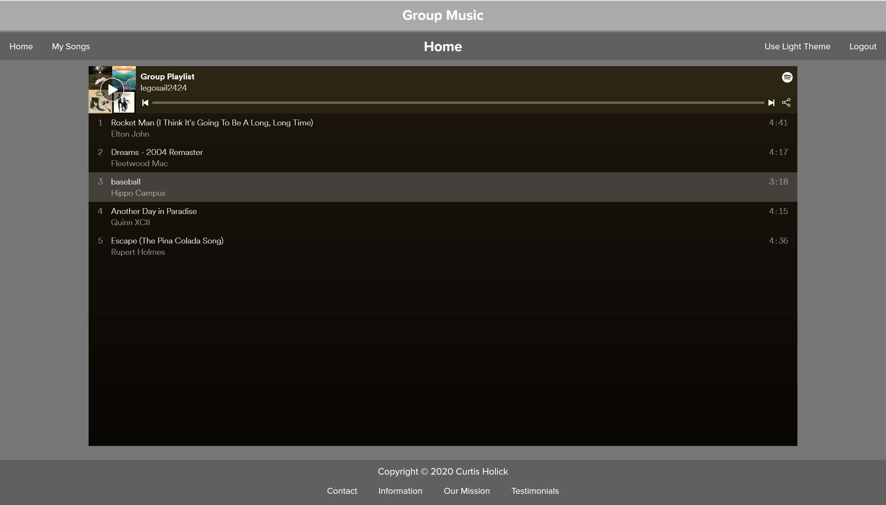
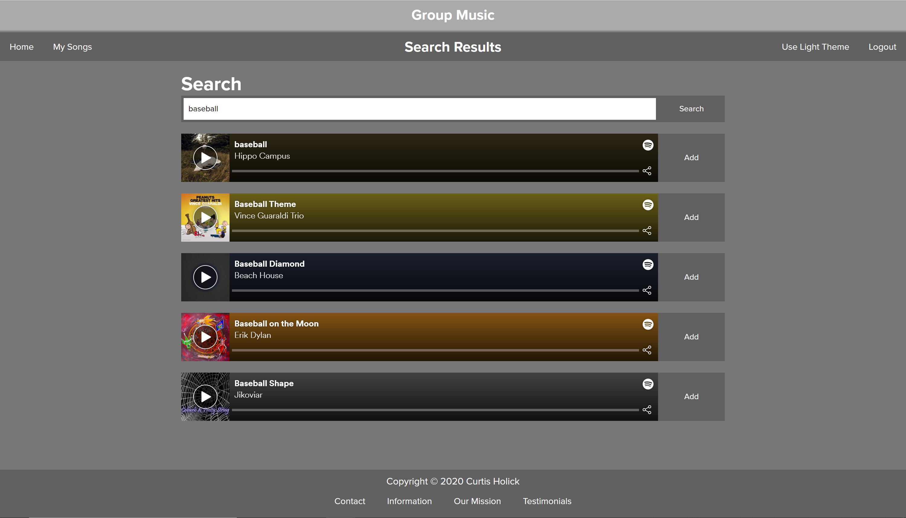

# Group-Music
Group playlist creation app

Group Music is a web application I created to allow collaboration on Spotify playlists. 

Users are able to add a set amount of songs to a playlist, which is created and updated on spotify.

Group Music is also entirely web based, so in theory nothing would need to be downloaded to use.

I have provided images of the web application here, and there are additional in the `Images` folder. The application will not run without the APIs being setup, but I have my API data stored in files not uploaded here. 

## Home Page

## Dashboard

## Search Results

## Light Theme

It also has the option to toggle between a light and dark theme, and will remember a users preference. 

## Packages Used

